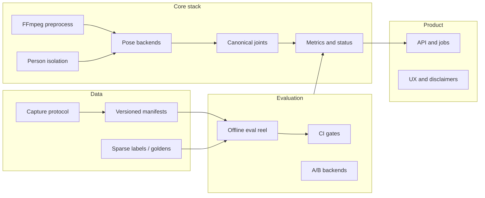

# Product-grade repository and roadmap (Laksh_AI)

## Premise (what “great” means here)

A **defensible** CV product is not defined by model novelty. It is defined by **(1) a measurement contract** users can trust, **(2) a dataset and eval harness** that detect regressions before users do, **(3) operational honesty** (offline vs online, hardware, preprocessing), and **(4) a narrow vertical** where you can win on quality. Your repo already has unusual strength in (1) and (2) on paper—`[docs/POSE_UPGRADE_EXECUTION_PLAN.md](docs/POSE_UPGRADE_EXECUTION_PLAN.md)`, `[app/pose/canonical.py](app/pose/canonical.py)`, `[evaluation/README.md](evaluation/README.md)`. The plan below **finishes the spine** and adds what is missing for **product** and **credible open source**.

---

## Phase A — Repository and engineering excellence (foundation)

**Goal:** Anyone cloning the repo gets a **reproducible** dev loop; CI reflects **real quality**, not “tests pass on my laptop.”

| Workstream                  | Actions                                                                                                                                                                                                                                                      |
| --------------------------- | ------------------------------------------------------------------------------------------------------------------------------------------------------------------------------------------------------------------------------------------------------------ |
| **Runtime pin**             | Single source of truth for Python (today CI uses 3.12 in `[.github/workflows/ci.yml](.github/workflows/ci.yml)` while `[PROJECT_CONTEXT.md](PROJECT_CONTEXT.md)` says 3.11—**pick one**, document in `README` + `CONTRIBUTING`, and align CI).               |
| **Dependencies**            | Prefer **locked** installs for CI (`requirements.lock` or `uv.lock` / `pip-tools`) so pose optional deps do not drift silently; keep `[requirements-pose-optional.txt](requirements-pose-optional.txt)` version-pinned with a short “why this version” note. |
| **Static quality**          | Promote **ruff** from optional to **required in CI** (`[pyproject.toml](pyproject.toml)`); add **mypy** incrementally on `app/pose/` and API contracts first—strictness ramps with coverage.                                                                 |
| **CI matrix (lightweight)** | Optional second job: **Python x OS** smoke (e.g. ubuntu + macOS) for `test-pose-core` only—full suite can stay ubuntu to control minutes.                                                                                                                    |
| **Artifacts**               | Document **exact** steps to obtain `pose_landmarker_heavy.task` (`[scripts/download_pose_model.py](scripts/download_pose_model.py)`); consider **checksum verification** in readiness script (already hinted in POSE plan P1b polish).                       |
| **Repo hygiene**            | Ensure **no tracked secrets**; `.gitignore` for `evaluation/clips`, `chroma_db`, large artifacts; add a **“first PR”** checklist in `[CONTRIBUTING.md](CONTRIBUTING.md)` pointing to eval protocol.                                                          |

**Exit criteria:** Green CI on default branch; new contributor can run `make test` + `make check-pose-readiness-strict` + documented model download without Slack help.

**Research-lab additions (what “serious” looks like beyond green CI):**

- **Determinism where cheap:** pin seeds for numpy/torch if/when training; for inference, document **non-deterministic** ops (GPU, threading) and **tolerance bands** for regression (e.g. angle within ε, not bitwise identity).
- **Two-speed CI:** **PR** = fast (unit + L0 + readiness); **nightly** = optional full eval + pose A/B when manifest paths exist in CI runner (or self-hosted runner with GPU)—**don’t** block every PR on 2-hour reels.
- **Regression bundle:** version **eval harness** with outputs; one command reproduces **last release scorecard** (commit hash + manifest hash + dependency lock hash in report header).

---

## Phase B — Data strategy and evaluation authority (the moat)

**Goal:** Move from “we have manifests” to **tiered datasets** with **claim discipline** matching `[docs/POSE_EVALUATION_PROTOCOL.md](docs/POSE_EVALUATION_PROTOCOL.md)` and §5 of the execution plan.

| Tier   | Contents                                                                                                                                                                         | Enables                                                                       |
| ------ | -------------------------------------------------------------------------------------------------------------------------------------------------------------------------------- | ----------------------------------------------------------------------------- |
| **L0** | Synthetic / unit fixtures + readiness scripts                                                                                                                                    | CI, mapping tests, no-GPU path (you largely have this).                       |
| **L1** | Small **curated internal** reel (30–80 clips) with **tags**, `expect_`* columns, documented capture per `[docs/GYM_EVAL_CAPTURE_AND_DATA.md](docs/GYM_EVAL_CAPTURE_AND_DATA.md)` | Regression detection, backbone A/B, honest marketing screenshots.             |
| **L2** | **Labeled** segments (rep boundaries, key events) for exercises in scope                                                                                                         | Train/fine-tune segmentation or classifiers; report F1/IoU with fixed splits. |

**Concrete deliverables**

1. **Manifest governance:** One **canonical gym manifest** path for CI (`[evaluation/gym_manifest.csv](evaluation/gym_manifest.csv)`); template stays for forks; **clip_id** immutability rules already documented—enforce in review.
2. **Metrics as products:** Publish an internal **scorecard** (markdown or small dashboard) per release: `detection_rate`, `pose_usable_heuristic`, basketball stability stats, **single_pass vs multipass** as required by §4 of the execution plan—**never** quote multipass-only numbers for “app performance.”
3. **Human labels:** Minimal tool (CVAT, Label Studio, or simple JSON sidecars) + **versioned label schema** referenced from manifest or ADR.
4. **Basketball vs gym:** Keep **two** eval tracks explicitly—`[evaluation/manifest.csv](evaluation/manifest.csv)` for legacy shot pipeline vs gym manifest—so pivot does not break regression story.

**Dataset hygiene (failure mode most student repos skip):**

- **Splits:** `train` / `val` / `test` with **subject-level** or **session-level** separation where possible—random frame splits **inflate** scores when the same person/background repeats.
- **Leakage:** No tuning on **test**; no “peeking” at test clips to set thresholds—thresholds fit on **val** only; test is touched **once per release** or frozen for months.
- **Negatives:** L1 must include **failure rows** (occlusion, multiperson, bad framing)—a model that only “works on clean” is **worse** than one that refuses cleanly; track **refusal rate** vs **error rate** separately.
- **Agreement:** For L2, **two annotators** on a subset + **disagreement protocol**—otherwise F1 is a fiction.
- **Temporal pose quality:** Track **jitter** (variance of joint positions) and **implausible jumps** frame-to-frame on L1—scalar “accuracy” without temporal sanity is how you ship shaky overlays.

**Exit criteria:** Every pose/preprocess PR carries **either** a manifest-backed table **or** a justified exception (docs-only); L1 reel exists outside git with **hashed** or versioned metadata checked in.

**Calibration (user trust, not just researcher accuracy):**

- Separate **raw model confidence** from **user-facing** “ready / degraded / unknown”—plot **calibration** (predicted confidence vs empirical error) on L1 when you have pseudo-labels or human spot checks.
- **Degenerate optimum:** A system that always says “insufficient data” can look “safe” but **useless**—pair **coverage** metrics with **error** metrics (e.g. % clips with actionable feedback at fixed false-advice budget).

---

## Phase C — Pose stack completion (technical debt that blocks product claims)

Align with your own roadmap: **P2 → P3** in `[docs/POSE_UPGRADE_EXECUTION_PLAN.md](docs/POSE_UPGRADE_EXECUTION_PLAN.md)`.

| Item                                                                                                                           | Work                                                                                                                                                                                                           |
| ------------------------------------------------------------------------------------------------------------------------------ | -------------------------------------------------------------------------------------------------------------------------------------------------------------------------------------------------------------- |
| **P2 Person isolation**                                                                                                        | Move from Haar+MIL v0 toward a **stronger detector** when hard-subset manifest shows need; document **failure modes** in `[app/pose/person_isolation.py](app/pose/person_isolation.py)`.                       |
| **P3 Canonical in product path**                                                                                               | Feature-flag **canonical joint path** inside `[app/physics_engine.py](app/physics_engine.py)` `KinematicAnalyzer`; **frozen** basketball manifest diff (MediaPipe-only vs canonical) before switching default. |
| **Offline vs online**                                                                                                          | Separate configs for **eval** (full quality) vs **API** (latency/frame cap/ROI)—execution plan §3; document in API responses (`analysis_mode`, preprocess flags).                                              |
| **Optional:** ONNX hash pinning in JSONL provenance (`[app/pose/provenance.py](app/pose/provenance.py)`) for reproducible A/B. |                                                                                                                                                                                                                |

**Exit criteria:** P3 gate satisfied with **no silent metric drift**; product code path documents which backbone + preprocess it uses.

---

## Phase D — Gym MVP (first vertical worth selling)

**Goal:** Deliver `[GOALS.md](GOALS.md)` Milestone 1: **bounded exercise set**, **rep segmentation**, **per-rep kinematic features** with `metric_status`-style semantics.

| Component            | Approach (defensible)                                                                                                                                                              |
| -------------------- | ---------------------------------------------------------------------------------------------------------------------------------------------------------------------------------- |
| **Exercise scope**   | Freeze **v0 list** (8–15 movements) + camera instructions in user-facing doc (not only dev docs).                                                                                  |
| **Rep segmentation** | Prefer **learned** temporal model or fine-tuned classifier **once L2 labels exist**; until then, **heuristic baselines** with explicit **low-confidence** flags—no fake precision. |
| **Features**         | Reuse canonical joints; per-rep aggregates (angles, ROM, velocity proxies) with **valid/degraded/unknown**—pattern already in basketball metrics.                                  |
| **Training**         | Standard ML hygiene: **fixed train/val splits**, seed, **no tuning on test reel**, metrics logged per run (W&B/MLflow optional; minimal JSON logs acceptable at small scale).      |
| **Ablations**        | One **independent variable** per experiment (new backbone, new smooth, new ROI)—**no** “everything changed” PRs without a table isolating each delta on L1.                        |

**Exit criteria:** Reported rep F1/IoU (or agreed proxy) on held-out L2 data; API returns **evidence-linked** feedback (features → text), consistent with `[PROJECT_CONTEXT.md](PROJECT_CONTEXT.md)`.

**Human evaluation for coaching (not replaceable by IoU):**

- **Structured rubric** on a **fixed** set of clips (e.g. 20–30): clarity, correctness, **grounding** (does the text match the numbers?), **actionability**—small n, but **versioned** rubric and blinded comparison when narrative changes.
- **LLM narrative:** If Gemini (or similar) remains in the loop, add **automatic checks** where possible: every claim must cite **computed fields** present in JSON; spot-check **hallucination** rate on the eval reel.

---

## Phase E — Product and “real GitHub project” surface

**Goal:** Operations and UX match the quality of the CV stack.

| Area                   | Actions                                                                                                                                                                                       |
| ---------------------- | --------------------------------------------------------------------------------------------------------------------------------------------------------------------------------------------- |
| **API**                | Versioned routes or schema version field; stable error model; **async job queue** for long videos (Redis/RQ, Celery, or cloud worker)—sync `POST /analyze-video` does not scale.              |
| **Storage**            | Object storage for uploads + **retention policy**; signed URLs; encryption at rest per your cloud.                                                                                            |
| **Observability**      | Structured logs, trace id per job, **p50/p95 latency**, failure taxonomy (decode vs pose vs OOM).                                                                                             |
| **Latency budget**     | Break down **decode**, **preprocess**, **pose** (per frame vs total), **downstream** (vector DB, LLM)—**know where you burn ms** before buying a bigger GPU.                                  |
| **Security**           | Rate limits, file size caps, virus scanning optional, dependency audit in CI (`pip-audit` or GitHub Dependabot).                                                                              |
| **Open source polish** | Top-level **Roadmap** section in `[README.md](README.md)` aligned with `[GOALS.md](GOALS.md)`; **License** clarity; **demo** GIF only if eval-backed; issue templates (bug / feature / eval). |
| **Shadow / canary**    | Before changing defaults, run **new stack** on **production-shaped** traffic or duplicate uploads **without** user-facing output—compare metrics to baseline.                                 |

**Exit criteria:** SLO defined (e.g. p95 job time for N-second clip); on-call playbook for common failures.

---

## Phase F — Generative media (explicitly later)

Keep **separate ADR and budget** per execution plan **P4** and `[docs/RESEARCH_PLAN_POSE_AND_LTX.md](docs/RESEARCH_PLAN_POSE_AND_LTX.md)`. **No** integration until pose tracks are stable enough to condition on and legal copy is ready—otherwise you ship **trust debt**.

---

## Dependencies between phases

- **A** enables trustworthy collaboration; **B** enables any serious model change.
- **C** must not lag **D** if gym metrics read from canonical path—otherwise you optimize the wrong graph.
- **E** can start **after** A and partial B (CI + job queue); full product hardening needs **D**’s API shape.

---

## Grading rubric (what “A” actually means)

Use this to avoid self-congratulation when the repo “looks professional.”

| Area                | B                     | B+                                       | A-                                       | A                                                 |
| ------------------- | --------------------- | ---------------------------------------- | ---------------------------------------- | ------------------------------------------------- |
| **Reproducibility** | README + manual steps | Locked deps + CI green                   | **+** scorecard command + hash in report | **+** nightly + frozen test + ablation discipline |
| **Data**            | Ad hoc clips          | L1 manifest + tags                       | **+** negatives + subject splits         | **+** L2 + agreement + frozen test                |
| **Metrics**         | Task accuracy only    | **+** temporal sanity + refusal/coverage | **+** calibration                        | **+** human rubric + LLM grounding checks         |
| **Product**         | Sync API              | **+** jobs + SLO                         | **+** shadow + latency breakdown         | **+** incident process + cost per job modeled     |

Your repo’s **documentation and canonical pose work** already push toward **B+ / A- on paper**; **L2, calibration, human eval, and shadow** are what separate **A-** from **A**.

---

## Brutal self-assessment (Karpathy / Hassabis bar)

**First-pass grade (original plan):** **B+ engineering, A- research intent.** Strong on “measure first,” light on **leakage, temporal metrics, calibration, human/LLM eval, and shadow**—the places where serious ML systems **actually** fail.

**After this refinement:** **A- as a roadmap** for a **small** team; **not** an **A** execution until the **rubric’s A-row** is partially filled with **artifacts** (not intentions).

**What the best builders optimize (this plan now encodes):**

1. **Numbers without context are marketing.** Mode + hardware + manifest hash + preprocess + **single-pass vs multipass**—already in your culture; the plan adds **regression bundle** and **tolerance bands** for stochastic inference.
2. **Leakage is the silent killer.** Subject/session splits, frozen test, no threshold tuning on test—explicit.
3. **Accuracy is not the product.** **Coverage vs error**, **refusal quality**, **calibration**—users feel **wrong confident advice** worse than “we’re unsure.”
4. **Pose is a time series.** Jitter and implausible jumps matter as much as mean angle error on a keyframe.
5. **One variable per experiment.** Non-negotiable for knowing why something changed.
6. **LLM narrative is a second model.** Groundedness checks and human rubric—same epistemic standard as pose.
7. **Default backbone until proven on deploy parity.** Still true; leaderboard numbers without **online** constraints are **entertainment**.

**What still blocks “A” roadmap → “A” reality (unchanged, stated harshly):**

- **Throughput:** L2 labeling and **rubric** reviews are **calendar-time** bound; without a budget line, they stay **fiction**.
- **Compute reality:** GPU nightly eval and A/B cost **money or discipline**; the plan assumes you either pay or accept slower iteration.
- **Business metric:** “Users coached” or “retention” is **not** in this repo plan—**correct** for a technical roadmap, but **no** technical A fixes a **wrong product**.

**Re-grade (this iteration):** **A- roadmap quality** (what to build and in what order), **B+ to A- institutional readiness** depending on whether you **fund** L1/L2 and labeling. **Karpathy-style verdict:** *“The loop is right; now go collect the painful data and stop changing five things at once.”*

---

## Suggested implementation order (single-threaded for quality)

1. **A** (CI, pins, ruff, Python alignment) — 1–2 weeks calendar time at part-time is realistic.
2. **B** (L1 reel + scorecard discipline) — ongoing; minimum viable L1 **before** large pose refactors.
3. **C** (P2/P3) — gated by B’s manifests.
4. **D** (gym MVP) — parallel **labeling** as soon as B’s capture protocol is stable.
5. **E** (product) — introduce job queue once **median** upload exceeds comfortable sync time.

This matches how strong teams ship: **instrumentation and data before clever models**.

**Order of parallel work (only if staffed):** Labeling + L2 can overlap **C** once L1 is stable; **do not** parallelize **A** and **C** (you’ll chase regressions without a frozen reel).
